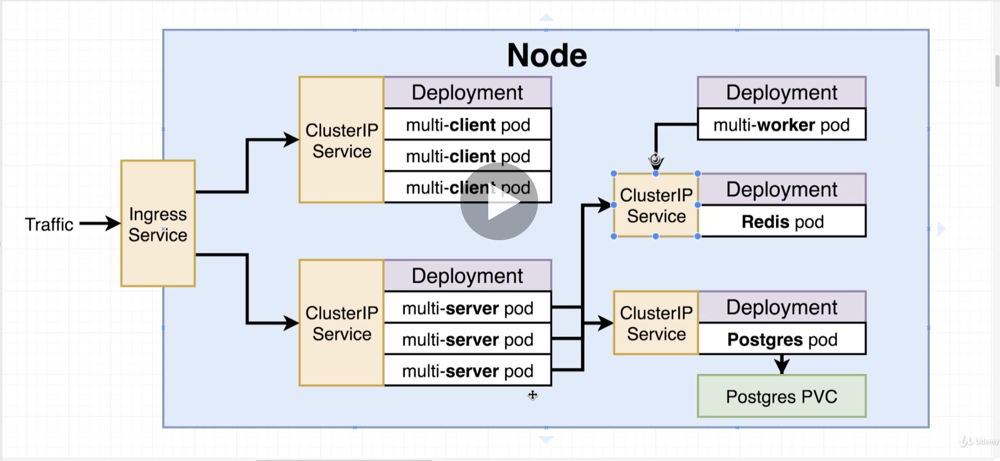

# Docker & Kubernetes Complete Guide (Udemy)

Notes on how to about setting up and running this app. The components are layed out as follows:

## Development Setup

### Minikube & VirtualBox Setup

Minikube is required to run Kubernetes cluster locally - and the command line program `kubectl` is used to interact with 
Minikube locally. Run the following [brew](https://brew.sh/) commands to install kubectl and minicube.

`brew install kubectl`
`brew install minikube`

Note: `kubectl` may already be installed if you have chosen to install it as part of the Google `gcloud` tools.

Go to [https://www.virtualbox.org/wiki/Downloads](https://www.virtualbox.org/wiki/Downloads) and download the latest 
OSX version and install

You can now start minikube up with:

`minikube start`

This should download the required images and start the cluster (if the app hangs, just restart).

Alternatively Docker Desktop's Kubernetes can be used instead of minikube. To enable, go to the Docker icon in the toolbar
and enable kubernetes and select docker-desktop.

You can check the status of minikube with

`minikube status`

You can also see information about the cluster with the command

`kubectl cluster-info`

To run the cluster, use the command

`kubectl apply -f k8s` - will run all the config files in the `k8s` directory

Other (useful) commands are:

- `kubectl apply -f client-pod.yaml` - create/update the config (i.e. a pod in this case)
- `kubectl delete -f client-pod.yaml` - to remove the pod (use the same config). Takes 10s to resolve
- `kubectl apply -f client-node-pod.yaml`
- `kubectl apply -f client-deployment.yaml` - use in preference of the pod
- `kubectl get pods` - list info about the pods
- `kubectl get pods -o wide` - include the ip addresses (internal)
- `kubectl get services`
- `kubectl get deployments`
- `minikube ip` - collect local IP for minikube (as not available under `localhost`)
- `kubectl describe pods` - get info on all the pods
- `kubectl describe pod client-pod` - get info on the object (kind) and name
- `kubectl config get-contexts` - show the contexts
- `kubectl config use-context docker-for-desktop`  - use a given context
- `kubectl get storageclass` - options for creating a persistent volume (in cloud can be GCP Google cloud persistent disk
 or AWS block store) 
- `kubectl describe storageclass` - more info about the class
- `kubectl get pv` - list out the persistent volumes (the actual instances of volumes external to the pods)
- `kubectl get pvc` - list out the persistent volume claims (the requests for volumes - i.e. available storage)

See [https://kubernetes.io/docs/concepts/storage/storage-classes/#provisioner](https://kubernetes.io/docs/concepts/storage/storage-classes/#provisioner) 
for different cloud storage options (persistent volumes)

Secret setup (for postgres password) - use an imperative command (rather than having config files)

`kubectl create secret generic pgpassword --from-literal PGPASSWORD=LetMeInPosgres12345`

Check secret has been created using:

`kubectl get secrets`

Repo used for the NGINX ingress:

[https://github.com/kubernetes/ingress-nginx](https://github.com/kubernetes/ingress-nginx)

Note: setup is different for different cloud vendors (i.e. Google Cloud Load Balancer)

Ingress then needs to be enabled for minikube (see instructions below)

[https://kubernetes.github.io/ingress-nginx/deploy/#minikube](https://kubernetes.github.io/ingress-nginx/deploy/#minikube)

The commands required setup ingress are as follows:

- `kubectl apply -f https://raw.githubusercontent.com/kubernetes/ingress-nginx/nginx-0.30.0/deploy/static/mandatory.yaml`
- `minikube addons enable ingress`

Note: if using docker for desktop, use the following commands instead:

- `kubectl apply -f https://raw.githubusercontent.com/kubernetes/ingress-nginx/master/deploy/static/mandatory.yaml`
- `kubectl apply -f https://raw.githubusercontent.com/kubernetes/ingress-nginx/master/deploy/static/provider/cloud-generic.yaml`
- `kubectl get svc -n ingress-nginx` - verify service has been created

Minikube dashboard setup

- `minikube dashboard`

For docker for desktop setup, see the Udemy Courselecture notes

[247. Docker Desktop's Kubernetes Dashboard](https://www.udemy.com/course/docker-and-kubernetes-the-complete-guide/learn/lecture/15492160#overview)

## Production Setup

## Reference

Kubernetes doesn't include any build process (this must be performed externally) - so images used to make the containers 
need to have already been created. Uses the label selector system (i.e. `component: web` - note, this the key/value are arbitrary)

- `Pods` - runs 1 or more closely related containers
- `Services` - sets up networking in a Kubernetes Cluster
    - `ClusterIP` - exposes a set of pods to _other objects in the cluster_ (can't be used to access pods from the outside world)
    - `NodePort` - expose a container to the outside world (only good for development processes!)
    - `LoadBalancer` - legacy way of getting network traffic into a cluster
    - `Ingress` - exposes a set of outside services to the world
- `Deployments` - used to run/manage a set of identical pods
- `Secrets` - securely stores a piece of information in the cluster, such as a database password. Types are:
    - `generic` - key/value
    - `docker-registry` - authentication with custom registry (instead of docker hub)
    - `tls` - https setup
    
- Kubernetes is a system to deploy containerised apps
- *Nodes* are individual machines (or vm's) that run containers
- *Masters* are machines (or vm's) with a set of programs to manage nodes
- Kubernetes didn't build the images - it got them from somewhere else
- Kubernetes (the master) decided where to run each container - each node can run a dissimilar set of containers
- To deploy something, we update the desired state of teh master with a config file
- The master works constantly to meet the desired state

To configure the VM to use the docker server, run the command (this only configures the current terminal window):

`eval $(minikube docker-env)` (or run `minikube docker-env` to see what is going on behind scenes)

- Can use same debugging techniques as in normal shell (i.e. `docker logs 1a96e04f58f0` (container id)), or open a 
shell with `docker exec -it 1a96e04f58f0 sh`. Note: a lot of these commands are available through `kubectl` - i.e. 
`kubectl logs client-deployment-66bc5b7b4-pdztr`
- Manually kill containers to test Kubernetes ability to 'self heal'
- Delete image cache in the node. I.e. `docker system prune -a`

